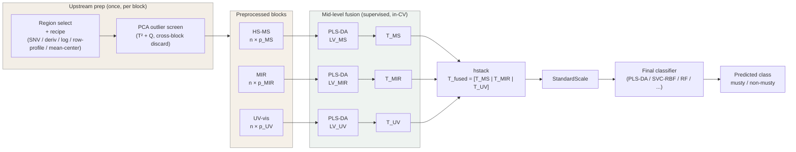
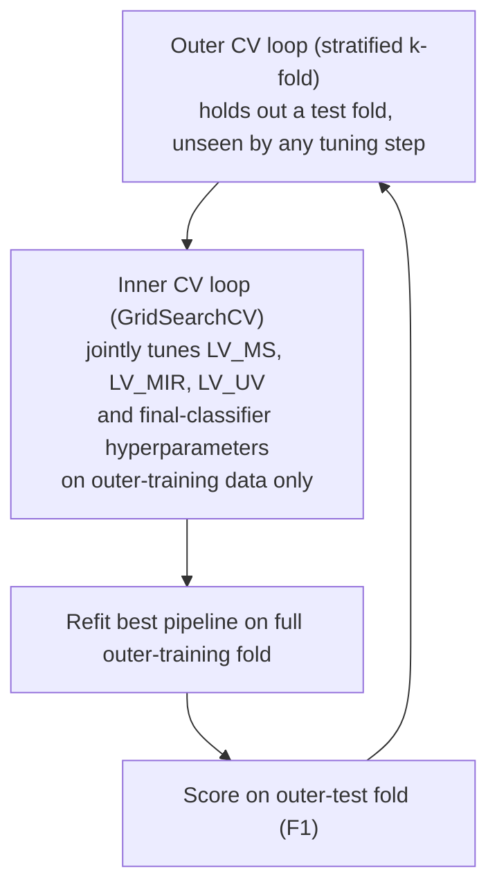

# Modelling Pipeline Description
**CAC2026 Data Challenge - Olive Oil Musty Defect Classification**

## 1. Summary

This submission classifies olive oil samples for the **musty defect**
(present/absent) using a **mid-level data-fusion** strategy that combines
PLS-DA latent scores from three instrumental blocks - headspace-mass
spectrometry (HS-MS), mid-infrared spectroscopy (MIR/ATR-FTIR), and UV-vis
spectrophotometry - followed by a final classifier trained on the fused score
space. The approach extends the **3MLpls** strategy of Borràs et al. (2016),
which the original authors identified as one of the strongest fusion
strategies for this dataset, while introducing three methodological changes:
joint hyperparameter optimisation across blocks, a swappable (optionally
non-linear) final classifier, and nested cross-validation for an unbiased
performance estimate.

Across a sweep of five candidate final classifiers evaluated under nested
cross-validation, an **SVM with an RBF kernel** was selected, achieving an honest
nested-CV **F1 of 0.78**. Relative to the original windows we also **widened the
MIR and UV-vis spectral regions**, which was the single most effective change
(see §4). Full settings and results are reported in §4.

## 2. Relationship to Borràs et al. (2016)

Borràs et al. tested three fusion levels - individual techniques, low-level
(LL) fusion of raw spectra, and mid-level (ML) fusion of PCA or PLS-DA scores
(MLpca / MLpls) - across two- and three-block combinations, selecting the
final model per defect class using a sensitivity/specificity criterion
combined with minimum inaccuracy, evaluated via repeated 65/35 train/test
splits.

For the **musty** defect specifically, the paper found low-level fusion of all
three techniques (3LL) marginally best - sensitivity/specificity 90/88 % and
~10.5 % inaccuracy - with mid-level PLS fusion (3MLpls) competitive (the
mid-level strategy "always using PLS-DA scores"). We nonetheless adopt the
**mid-level PLS fusion (3MLpls)** family as our starting architecture because
it keeps the per-block dimensionality reduction supervised and interpretable
per instrument, and because it is the natural attachment point for the
extensions below.

### What we changed, and why

| Aspect | Borràs et al. (2016) | This submission |
|---|---|---|
| Per-block compression | PLS-DA scores (MLpls) or PCA scores (MLpca), compared separately | PLS-DA scores only (MLpls family); PCA dropped - see rationale |
| Latent-variable (LV) selection per block | Chosen **independently per block** before fusion | Chosen **jointly** with the other blocks' LVs and the final classifier's hyperparameters in a single global search |
| Final classification step | PLS-DA (linear decision boundary) | **Pluggable** classifier. Five compared under nested CV - PLS-DA, LDA, QDA, SVC-RBF, Random Forest; **SVC-RBF selected** (see §4) |
| Performance estimation | Repeated random 65/35 train/test split, no nested validation | **Nested CV**: inner loop for hyperparameter search, outer loop for an unbiased F1 estimate |
| Outlier screening | PCA-based removal of calibration outliers | PCA Hotelling's T² + Q-residuals, with cross-block discard. Evaluated, but no samples removed in the final model (removal did not improve honest F1) |
| Preprocessing & region | Fixed per-defect windows + recipe | Author windows as a starting point, then **MIR widened to 1500–700 cm⁻¹ and UV-vis to 300–1000 nm** (with a larger Savitzky–Golay window) - the main empirical improvement (see §4) |

**Why drop MLpca.** PCA finds directions of maximum *variance* per block, which
need not align with the variance that *discriminates* musty from non-musty
samples. PLS-DA instead maximises covariance between the spectral block and the
binary class label, so its scores are class-discriminative by construction.
This is consistent with the original paper's finding that MLpca did not improve
on (or worsened) the best individual models, so we focus search effort on MLpls.

**Why joint, global LV selection.** In the original design each block's optimal
LV count is chosen in isolation, before the fusion step exists. The best LV
count for, say, MIR alone is not guaranteed to be best once its scores are
concatenated with HS-MS and UV-vis scores, since blocks may carry redundant or
complementary information only visible after fusion. We therefore treat
`(LV_HS-MS, LV_MIR, LV_UV-vis)` plus the final classifier's hyperparameters as
**one joint search space**, optimised together inside the cross-validation loop.

**Why a pluggable final classifier.** PLS-DA's decision rule is linear. After
fusion, the input to the final step is a low-dimensional matrix of already
class-relevant scores - a favourable setting for non-linear classifiers
(SVM-RBF, Random Forest) to capture between-block interactions a linear
boundary cannot. We keep the final classifier a swappable component (default
PLS-DA, to stay faithful to 3MLpls) and select the best one - architecture and
hyperparameters together - via the same nested CV used for the LV counts.

**Why widen the spectral regions.** The author-suggested windows (MIR 1040–795
cm⁻¹, UV-vis 580–1000 nm) are deliberately narrow. Because per-block PLS-DA is
already a supervised filter that down-weights uninformative variables, supplying
it with a *wider* region lets it find discriminative structure the narrow window
excludes, rather than risking noise inflation. Widening MIR to 1500–700 cm⁻¹ and
UV-vis to the full 300–1000 nm range (and enlarging the Savitzky–Golay derivative
window from 7 to 13 points) raised the honest nested-CV F1 from ≈0.69 to ≈0.76 and
reduced the train/test gap - by a clear margin the most effective single change we
made. Widening is not universally beneficial: extending HS-MS or pushing MIR into
the bulk-ester carbonyl band (≈1745 cm⁻¹) both *hurt*, so the final windows are the
best of those tested (§4), not simply the widest.

## 3. Pipeline Architecture

Block preprocessing and outlier screening run **upstream** (once, on the
calibration set); the score-fusion estimator below is what the
cross-validation loop fits and tunes.

In the selected model the final classifier is `SVC(kernel='rbf', C=1,
gamma='scale')`. The `StandardScale` step is mandatory in that configuration
because the RBF kernel is distance-based and the fused blocks differ in scale; for
tree-based heads (Random Forest) it is unnecessary and was disabled.

**Validation wrapper (nested cross-validation):**

Within each outer fold, the per-block PLS-DA scorers, the fusion, the scaler,
and the final classifier are all fit using only that fold's training data, so
the reported F1 is not optimistically biased by those stages. One caveat:
upstream block preprocessing - including the stateful `mean_center` step - is
currently fit once on the full calibration set rather than refit inside each
outer fold. The stateless steps (SNV, derivative, log, row-profile) leak
nothing; `mean_center` introduces only a minor, commonly-accepted simplification.

## 4. Final Model and Results

### Classifier sweep

Five candidate final classifiers were compared under identical preprocessing,
regions, and nested CV (5 outer × 3 inner stratified folds, scored by F1), on all
220 calibration samples:

| Final classifier | Type | Nested-CV F1 |
|---|---|---|
| QDA | non-linear (quadratic) | 0.688 ± 0.066 |
| LDA | linear | 0.745 ± 0.054 |
| PLS-DA | linear | 0.765 ± 0.052 |
| Random Forest | tree ensemble | 0.775 ± 0.045 |
| **SVC-RBF (selected)** | kernel (non-linear) | **0.777 ± 0.034** |

Values are the coarse-grid nested-CV estimates (the directly comparable protocol
across heads); a local fine refinement of each winner left the ranking unchanged.
Every head except QDA falls within ≈0.745–0.777 - statistically indistinguishable
given the fold-to-fold spread. SVC-RBF and Random Forest are co-best; **SVC-RBF
was selected** for its lowest variance (±0.034) and clean continuous decision
score, and because the two models agree on 23 of 24 test samples. QDA
underperforms because it must estimate a per-class covariance in the fused score
space, which is poorly conditioned at this sample size.

### Selected model and settings

- **Architecture:** mid-level PLS fusion + SVC-RBF head (3MLpls with a kernel
  classifier).
- **Per-block PLS latent variables:** HS-MS = 4, MIR = 9, UV-vis = 9.
- **Final classifier:** `SVC(kernel='rbf', C=1, gamma='scale')` on
  StandardScaled fused scores; decision threshold 0.5.
- **Preprocessing recipes:**
  - HS-MS, 100–125 m/z: row-profile → log → mean-centre.
  - MIR, 1500–700 cm⁻¹: SNV → 1st-derivative Savitzky–Golay (poly 2, 13-pt
    window) → mean-centre.
  - UV-vis, 300–1000 nm: SNV → 1st-derivative Savitzky–Golay (poly 2, 13-pt
    window) → mean-centre.
- **Outliers:** none removed - all 220 calibration samples retained.

### Performance

| Metric | Honest nested-CV (5×3) | Calibration fit (resubstitution) |
|---|---|---|
| F1 | **0.777 ± 0.034** | 0.939 |
| Precision | 0.796 ± 0.034 | 0.972 |
| Recall | 0.762 ± 0.055 | 0.908 |
| Inaccuracy | – | 4.1 % |

The nested-CV figure is the unbiased estimate; the calibration fit is optimistic
(the model has seen those samples) and the gap reflects expected overfitting. On
the 24-sample blind test set the selected model predicts **7 musty / 17
non-musty**.

### Key findings from the search

- **Region widening was the main improvement.** Extending MIR to 1500–700 cm⁻¹ and
  UV-vis to 300–1000 nm (with a 13-point derivative window) raised nested-CV F1
  from ≈0.69 to ≈0.76 and shrank the train/test gap - the most effective single
  change. Further preprocessing variants were each tested and did **not** beat this
  configuration: HS-MS window 50–160 m/z, MIR carbonyl extension to 1800 cm⁻¹, MIR
  2nd-derivative, and HS-MS PQN normalisation.
- **HS-MS is the dominant block.** Random-Forest feature importances on the fused
  scores attribute ≈73 % (permutation) / ≈47 % (impurity) to HS-MS, concentrated
  in its first PLS component - consistent with mustiness being an aroma defect that
  headspace-MS measures directly. MIR and UV-vis are complementary. A *low* optimal
  HS-MS LV count reflects a concentrated signal, not an unimportant block.
- **Decision-threshold tuning did not help.** An F1-optimal threshold
  (`TunedThresholdClassifierCV`) was unstable at n = 220 and lowered the honest F1,
  so the default 0.5 was retained.
- **The ceiling appears feature-bound.** Five classifier families and four
  preprocessing variants all plateau near F1 ≈ 0.78, indicating the limit is set by
  the information content of the preprocessed spectra rather than the classifier or
  its tuning.

### Remaining open items

- **Data-driven variable selection** (interval-PLS, sparse-PLS) was considered but
  deprioritised: PLS already performs supervised compression, and the dominant
  HS-MS signal is captured in a single component, so input-variable filtering
  offered little expected upside.
- **In-fold preprocessing.** `mean_center` (and any future stateful step such as
  `pqn`) is fit once on the full calibration set; moving it inside the CV folds
  would remove the minor simplification noted in §3.
- **Structural fusion alternatives** (block-weighted fusion, SO-PLS / MBPLS) are
  unexplored and are the most plausible route to exceed the current ceiling, given
  the strong HS-MS dominance.

## 5. References

**Code repository** - full pipeline, notebooks (02a–02f), and this description:
https://github.com/SamdGuizani/CAC-2026_Data-Challenge_Olive-Oil-Sensory-Defects-Detection-Using-Chemometrics

**Reference paper** - Borràs, E., Ferré, J., Boqué, R., Mestres, M., Aceña, L., &
Busto, O. (2016). Olive oil sensory defects classification with data fusion of
instrumental techniques and multivariate analysis (PLS-DA). *Food Chemistry*, 203,
314–322. https://doi.org/10.1016/j.foodchem.2016.02.038
